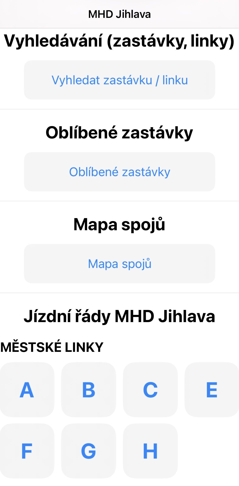
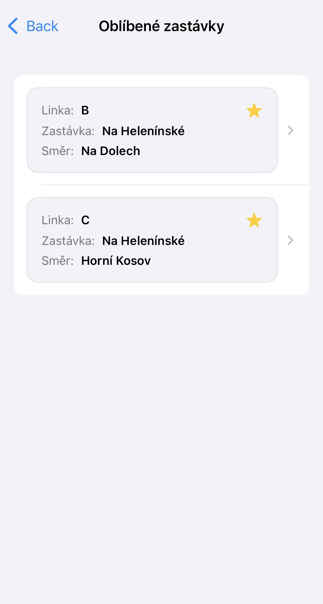
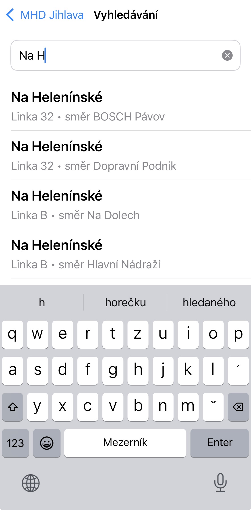
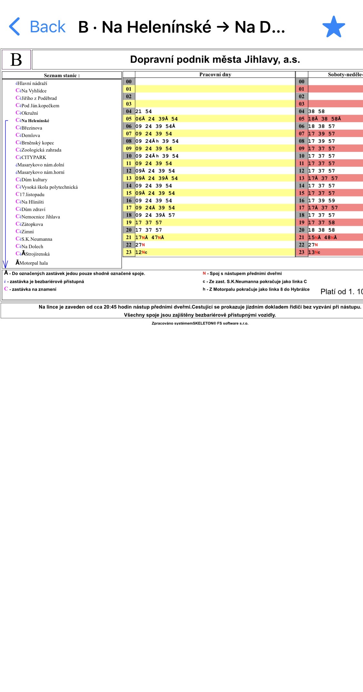
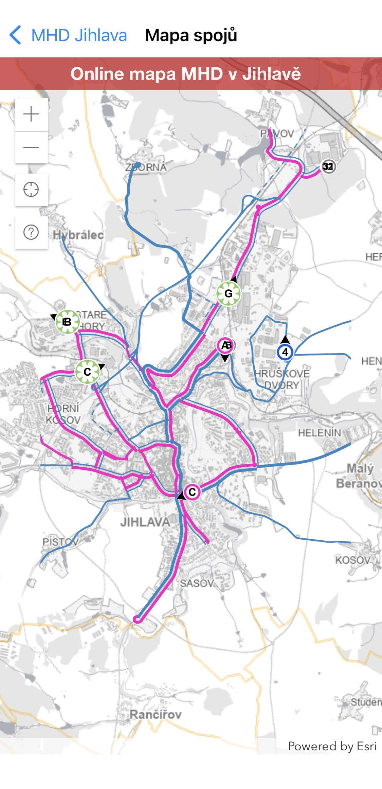

# 🚌 MHD-Jihlava

**MHD-Jihlava** je iOS aplikace vytvořená v **Xcode** určená pro zobrazení jízdních řádů městské hromadné dopravy v Jihlavě.  
Aplikace umožňuje nejen rychle vyhledat spoje, ale také zobrazí jejich **aktuální polohu na mapě**.  
Jedná se o open-source projekt, jehož cílem je nabídnout obyvatelům i návštěvníkům Jihlavy jednoduchý a moderní způsob sledování MHD.

---

## ✨ Funkce aplikace
- 📅 Zobrazení kompletních **jízdních řádů** pro MHD Jihlava  
- 🗺️ **Interaktivní mapa** s polohou spojů v reálném čase  
- 🔍 Vyhledávání spojů a zastávek  
- 📱 Moderní **iOS aplikace v SwiftUI** (projekt vytvořen v Xcode)   

---

## ⚠️ Důležité upozornění
Tato aplikace **není distribuována přes App Store**.  
Je nutné ji nahrát do telefonu ručně pomocí **.ipa instalátoru**.  

👉 Po nahrání do zařízení aplikace **funguje pouze 7 dní** (limit Apple vývojářských profilů bez placeného developer účtu).  
Poté je nutné ji znovu nainstalovat pomocí .ipa instalačního programu Sideloadly.

---

## 🚀 Instalace pomocí IPA instalátoru

1. Stáhni `.ipa` z Releases
2. Stáhni Sideloadly – je na stejném místě jako `.ipa`.  
   - Pokud máš macOS, použij **SideloadlySetup.dmg** (otevři `.dmg` a přetáhni Sideloadly do Aplikací)  
   - Pokud máš Windows, použij **SideloadlySetup64.exe** (spusť instalátor a nainstaluj aplikaci)
3. Otevři Sideloadly
4. Nahraj `MHD-Jihlava.ipa` do Sideloadly (`.ipa` se nachází v hlavní složce repozitáře)
5. Zadej svůj Apple ID do kolonky **Apple ID**
6. Klikni na **Start**
7. Zadej heslo ke svému Apple ID
8. Hotovo – aplikace je nainstalována

---

## ▶ Potřebné kroky ke spuštění aplikace

1. Na telefonu otevři **Nastavení (Settings)** → **Obecné (General)** → **VPN a správa zařízení (VPN & Device Management)**
2. Vyber profil se svým Apple ID (bude zde uveden tvůj e-mail)
3. Klepni na **Důvěřovat (Trust)** a potvrď

---

## 🔒 Aktivace Developer Mode (vyžadováno pro iOS 16+)

1. Otevři **Nastavení (Settings)**
2. Přejdi do **Soukromí a zabezpečení (Privacy & Security)**
3. Sjeď dolů a otevři **Developer Mode**
4. Zapni **Developer Mode**
5. Restartuj zařízení
6. Po restartu potvrď zapnutí Developer Mode

Bez zapnutého Developer Mode a důvěřování e-mailu aplikace nepůjde spustit.
---

## 🛠️ Použité technologie
 - Swift / SwiftUI
 - Xcode
 - iOS SDK
 - MapKit pro práci s mapou
 - LocationWebView pro získání polohy
 - Open-source data o MHD

---

## 📸 Screenshoty

 

<figure style="display:inline-block; margin: 80px 180px;">
<figcaption align="center" style="margin-bottom: 32px; font-size: 28px;">
<b>Hlavní obrazovka</b>
</figcaption>
   

</figure>

   

<figure style="display:inline-block; margin: 80px 180px;">
<figcaption align="center" style="margin-bottom: 32px; font-size: 28px;">
<b>Hlavní obrazovka (detail spojů)</b>
</figcaption>
   

</figure>

   

<figure style="display:inline-block; margin: 80px 180px;">
<figcaption align="center" style="margin-bottom: 32px; font-size: 28px;">
<b>Oblíbené</b>
</figcaption>
   

</figure>

   

<figure style="display:inline-block; margin: 80px 180px;">
<figcaption align="center" style="margin-bottom: 32px; font-size: 28px;">
<b>Vyhledávání</b>
</figcaption>
   

</figure>

   

<figure style="display:inline-block; margin: 80px 180px;">
<figcaption align="center" style="margin-bottom: 32px; font-size: 28px;">
<b>Pohled na jízdní řád</b>
</figcaption>
   

</figure>

   

<figure style="display:inline-block; margin: 80px 180px;">
<figcaption align="center" style="margin-bottom: 32px; font-size: 25px;">
<b>Mapa spojů</b>
</figcaption>
   

</figure>

---

## Poznámky
Je možné že nějaké spoje nebo zastávky chybí, ale v tuto chvíli se nejspíše pracuje na jejich přidání. Snažím se tuto aplikaci udržovat co nejaktuálnější.
 - Pokud máte nějaké otázky k aplikaci nebo nějaké návrhy třeba na zlepšení nebo jste našli chybu, napište mi na **E-Mail: ytb-kuba@seznam.cz**
